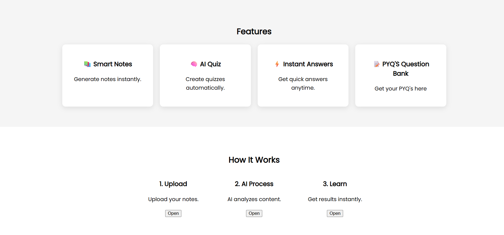
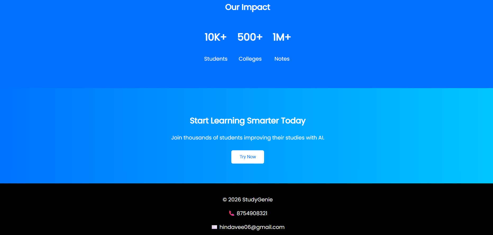

# Landing Page - Oasis Infobyte Internship

## Objective
To design and develop a clean, responsive and professional landing page 
using HTML and CSS that showcases web design skills.

## Steps Performed
1. Planned the layout and structure of the landing page
2. Created the HTML structure with semantic elements
3. Styled the page using CSS with a professional look
4. Added responsive design for all screen sizes
5. Tested the page on different screen sizes

## Tools Used
- HTML
- CSS
- VS Code (Code Editor)
- Chrome Browser (Testing)

## Outcome
Successfully built a fully responsive and professional landing page with:
- Clean and modern UI design
- Responsive layout for all devices
- Attractive color scheme and typography

## Screenshots

### Hero Section

### Features Section

### Full Page Preview

## Author
Hindavee Magdum - OIBSIP Intern

